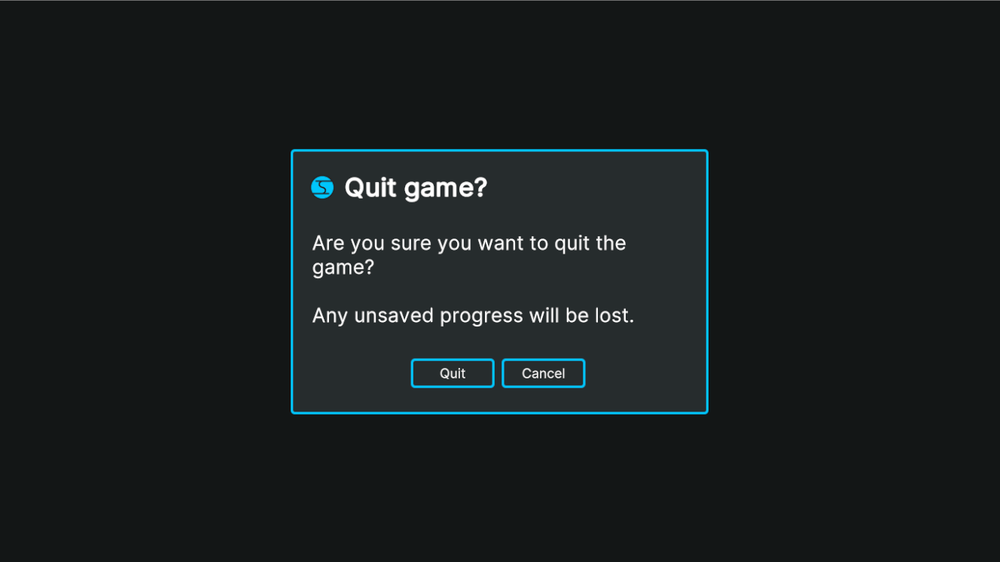
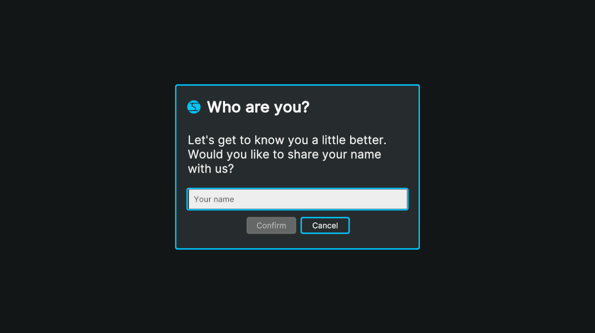
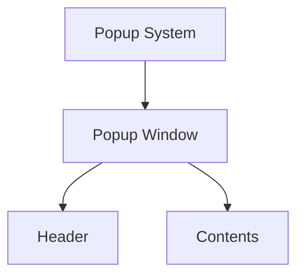

# ![Impossible Odds Logo][Logo] Impossible Odds - Popups

The Impossible Odds - Popups package allows you to easily show popup messages in your Unity project. It works both in
Unity's Canvas (Legacy UI and Text Mesh pro) and UI Toolkit systems.

## Setup

To start using the popup system, there's a simple scene setup involved. Depending on your preferred UI framework, drag
one of the following prefabs into your scene:

* `LegacyPopupSystem` or `TMPPopupSystem` if you're using the Canvas UI system.
* `UIToolkitPopupSystem` if you're using the UI Toolkit system.

That's it! You're ready to start showing popups on the screen.

Each of these prefabs have some common traits:

* They all have a 'popup display system' component that represents the specific implementation of the chosen UI
  framework.
* They all share a `Popup` component. This component acts as a singleton, so only one of them is allowed to be in the
  scene.

## Displaying popups

To start using the popup system in your project now, simply use the static `Popup` class from within your scripts.
It is found in the `ImpossibleOdds.Popups` namespace.

`Popup` allows you to call forth two kinds of popups:

### Simple popups

A simple popup is a popup window with a single text message being displayed along with zero or more buttons for the
user to pick from. For each button, you can set the text and the action to perform when it's being clicked on.

To show a simple popup window on the screen, use the `ShowSimplePopup` method and provide it with a _description_ object
of the popup.

```C#
Popup.ShowSimplePopup(new SimplePopupDescription()
{
    Header = "Quit game?",
    Contents = "Are you sure you want to quit the game?\n\nAny unsaved progress will be lost.",
    Buttons = new[]
    {
        new PopupButtonDescription()
        {
            text = "Quit",
            onClickAction = Application.Quit
        },
        new PopupButtonDescription()
        {
            text = "Cancel"
        }
    }
});
```



Note that you don't need to do anything for the popup to be dismissed if you provide it with a set of buttons. The popup
system will hook itself into each of the provided buttons to close the popup window once clicked. However, if no
buttons are present, it's expected of the caller to close the popup using the provided handle through the `ClosePopup`
method on the handle, or passing the handle to the popup system.

### Custom popups

Custom popup windows can be created as well. They require a little work and the required implementation details depend
on which display system (Canvas or UI Toolkit) you're using.

* Unity's Canvas system: your popup should implement the `ImpossibleOdds.Popups.Canvas.ICustomPopupContents` interface.
* UI Toolkit system: your popup should implement the `ImpossibleOdds.Popups.UIToolkit.ICustomPopupContents` interface.

These interfaces require you to define some common properties, and some that are specific to the display system being
used. For example, the Canvas system requires an instantiated prefab so that is can be placed in the
hierarchy of the Canvas and whether to destroy it after it has been closed, while the UI Toolkit one will require you to
return a visual element that will be placed in the document tree.

An example of a custom popup in the Canvas system could look like this:

```C#
public class CustomCanvasPopup : MonoBehaviour, ICustomPopupContents
{
    public event Action onClosePopup; 
    
    [SerializeField]
    private InputField inputField;
    [SerializeField]
    private Button buttonOk;
    [SerializeField]
    private Button buttonCancel;

    public string Header => "Who are you?";
    public bool DestroyAfterClose => true;
    public RectTransform ContentsRoot => transform as RectTransform;

    private void Start()
    {
        // Initialise the popup and hook up to the necessary events.
    }
}
```

The same popup in the UI Toolkit system would look like this:

```C#
public class CustomUITKPopup : ICustomPopupContents
{
    public event Action onClosePopup;

    public string Header => "Who are you?";

    public VisualElement ContentsRoot
    {
        get;
    }

    public CustomUITKPopup(VisualTreeAsset popupContentsAsset)
    {
        ContentsRoot = popupContentsAsset.Instantiate();
        
        // Query the contents, initialise the popup and hook up to the necessary events.
    }
}
```



Since you have full control over the contents of these custom popups, it's also up to you to call the necessary
`onClosePopup` event when done, or call the `ClosePopup` method on the popup handle or on the static `Popup` class.

## Customisation

Chances are you will want to change the look of the popup windows. Each kind of popup display system consists of a
couple of prefabs or objects. All assets used are found in the _Impossible Odds/Popups/Prefabs_ directories.

Both systems work with the same basic setup:



The popup display system will spawn and place the popup windows, and a popup window will have a header and contents.
The contents will depend on whether it's a simple or a custom popup.

### Canvas

Customising the Canvas system can be done by adjusting the prefabs it works with, or create local copies of the prefabs
and adjust them.

### UI Toolkit

The UI Toolkit implementation has a document defined for each individual element, as well as a separate stylesheet.
However, when integrating it in your existing project, make sure to set the correct panel settings to make the visual
elements receive the correct styling and events.

## Unity Version

Developed and tested on Unity 2021.3 LTS.

## License

This package is provided under the [MIT][License] license.

[License]: ./LICENSE.md

[Logo]: ./Docs/Images/ImpossibleOddsLogo.png